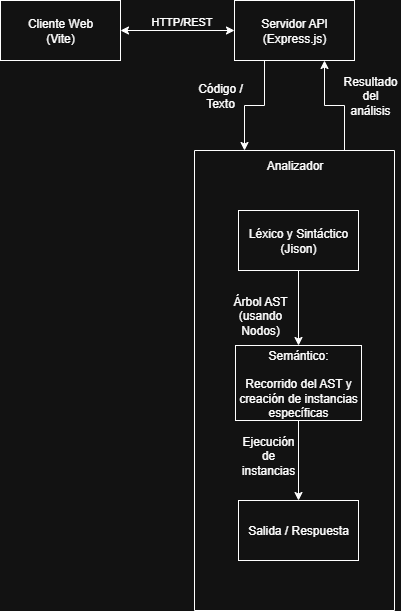

# Analizador Léxico, Sintáctico y Semántico

> **Intérprete de lenguaje personalizado** desarrollado con **Jison** y **Express.js**

Este proyecto implementa un compilador que incluye análisis léxico, sintáctico y semántico para un lenguaje de programación personalizado. Utiliza **Jison** para la generación automática del parser y el **patrón Intérprete** para la ejecución del código.

## Descripción General

El sistema está diseñado como una **aplicación full-stack** que permite:

- **Frontend (React + Vite)**: Interfaz web interactiva para escribir y probar código
- **Backend (Express.js)**: API REST que procesa y ejecuta el código fuente
- **Analizador**: Motor de análisis que convierte código fuente en un AST

### Arquitectura del Sistema


## Características del Lenguaje

### Elementos Implementados

| Categoría | Elementos Soportados |
|-----------|---------------------|
| **Variables** | Declaración, asignación y uso de variables |
| **Control de Flujo** | `if/else`, `while` |
| **Operadores Aritméticos** | `+`, `-`, `*`, `/`, `%` |
| **Operadores Relacionales** | `==`, `!=`, `<`, `>`, `<=`, `>=` |
| **Operadores Lógicos** | `&&`, `||`, `!` |
| **Entrada/Salida** | `print()` para mostrar resultados |
| **Estructuras** | Bloques `{ }`, comentarios `//` y `/* */` |
| **Tipos de Datos** | Números, cadenas, booleanos |

## Jison
Ejemplo básico de uso de Jison en [ejemplo_simple/README.md](ejemplo_simple/README.md).

### Instalación

```bash
# Instalar Jison globalmente
npm install -g jison
```

### Generar Parser usando npm
```bash
# Generar parser desde la gramática
npx jison ./src/gramatica/gramatica.jison -o ./src/gramatica/gramatica.js

# O usar el script npm predefinido
npm run parser
```

## Instalación y Configuración

### Requisitos Previos
- **Node.js**
- **npm**

### Instalación del Servidor
```bash
# Navegar al directorio del servidor
cd servidor

# Instalar dependencias
npm install

# Generar parser (automático en primera ejecución)
npm run parser
```

### Instalación del Cliente
```bash
# Navegar al directorio del cliente
cd cliente

# Instalar dependencias
npm install
```

## Ejecución del Proyecto

### Iniciar el Servidor (Backend)
```bash
# Modo desarrollo (con auto-reload)
npm run dev

# Modo producción
npm start
```
> El servidor se ejecuta en: `http://localhost:3000`

### Iniciar el Cliente (Frontend)
```bash
# En otra terminal, desde /cliente
npm run dev
```
> El cliente se ejecuta en: `http://localhost:5173`

## API Endpoints

### `POST /analizar`
**Descripción**: Ejecuta análisis completo (léxico, sintáctico y semántico) del código.

**Request Body**:
```json
{
  "codigo": "x = 10;\nprint('Hola mundo:', x);"
}
```

**Respuesta básica**:
```json
{
  "exito": true,
  "salida": ["Hola mundo: 10"]
}
```

## Ejemplos para probar el nuevo lenguaje
Para probar estos ejemplos pueden usar la interfaz web, copiando y pegando el código en el editor.

### Operaciones Básicas
```javascript
// Asignación de variables
numero = 42;
texto = "Hola Mundo";
booleano = 4>5;

// Operaciones aritméticas
suma = 10 + 5;
producto = numero * 2;
modulo = 15 % 4;

print("Resultado:", suma, producto, modulo, booleano);
```

### Estructuras de Control
```javascript
// Condicional simple
edad = 18;
if (edad >= 18) {
    print("Eres mayor de edad");
} else {
    print("Eres menor de edad");
}

// Bucle while
contador = 0;
while (contador < 5) {
    print("Iteración número:", contador);
    contador = contador + 1;
}
```

### Ejemplo Avanzado: Triángulo de Asteriscos
```javascript
// Triangulo simple de 4 niveles
niveles = 4;
fila = 1;

while (fila <= niveles) {
  espacios = niveles - fila;
  
  // Imprimir espacios
  contador_espacios = 1;
  salida_consola = '';
  while (contador_espacios <= espacios) {
      salida_consola = salida_consola + ' ';
      contador_espacios = contador_espacios + 1;
  }
  
  // Imprimir asteriscos (2*fila - 1)
  asteriscos = 2 * fila - 1;
  contador_asteriscos = 1;
  while (contador_asteriscos <= asteriscos) {
    salida_consola = salida_consola + '*';
    contador_asteriscos = contador_asteriscos + 1;
  }
  print(salida_consola);
  fila = fila + 1;
}
```

### Algoritmo: Números Pares
```javascript
// Imprimir numeros pares
a = 20;
while (a>=0) {
  if (a%2 == 0) {
    print(a);
  }
  a = a-1;
}
```
